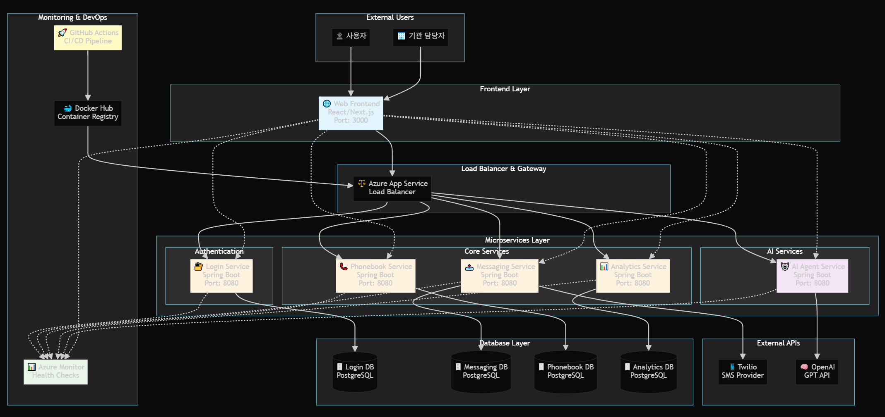

# 📡 공인알림문자 서비스 — MSA Project Hub

> 공공 및 민간 기관의 대량 알림(SMS)을 **신뢰성 있고 효율적**으로 전송하고,  
> **통계 시각화·AI Agent 지원**까지 제공하는 MSA 학습/실전 프로젝트입니다.

---

## 📌 기본 정보

- **팀명**: 🚀 1조

### 👥 담당자 & 서비스

| 담당자     | 담당 서비스                          |
|------------|-------------------------------------|
| **김지우** | 전화번호부, 로그인                   |
| **이성무** | 프론트엔드, AI Agent, 메시지 보내기 |
| **강수민** | 메시지 보내기, 메시지 대시보드       |

---

### 🌐 데모 링크

| 구분 | URL |
|------|-----|
| **프로덕트** | https://web-frontend-ffasfgacfyceeagj.koreacentral-01.azurewebsites.net |
| **프론트엔드** | https://web-frontend-ffasfgacfyceeagj.koreacentral-01.azurewebsites.net |
| **로그인** | https://login-svc-gbg8ephsd6bufnca.koreacentral-01.azurewebsites.net |
| **메시지 보내기** | https://messaging-svc-a0euekhwgueqd7c0.koreacentral-01.azurewebsites.net |
| **메시지 대시보드** | https://analytics-svc-aucrheemh4edbtac.koreacentral-01.azurewebsites.net |
| **전화번호부** | https://phonebook-svc-dtd4f8f9cyfee5c0.koreacentral-01.azurewebsites.net |
| **AI Agent 메시지 보내기** | https://aiagent-svc-dka3epddc7f5hdbm.koreacentral-01.azurewebsites.net |

---

### 🏷️ 릴리즈 정보
- **버전**: `v1.0`  
- **날짜**: `2025-08-21`

---

### ✨ 주요 기능
- 📩 메시지 전송  
- 📜 메시지 기록 저장  
- 🤖 AI Agent 지원  
- 📊 메시지 대시보드 (전송량, 성공률 등)  
- 📞 전화번호부 관리  

---

### 🌟 프로젝트 특장점
**📊 실시간 대시보드 제공**
- 문자 서버와 연동해 데이터를 실시간 업데이트
- [근거](https://eight-store-0c3.notion.site/256d8432636380889e17f72c60c1cb8f?source=copy_link)

**🔄 안정적인 문자 리트라이**
- Transient 에러 발생 시 최대 3회 자동 재전송
- 메시지 전송의 안정성과 신뢰성 확보

**🧩 MSA 기반 독립 배포**
- 마이크로서비스 아키텍처(MSA) 설계로 서비스별 독립 배포·운영 가능
- 특정 서비스 장애 발생 시에도 전체 서비스는 정상 동작
- 시스템 확장성 & 안정성 강화
- [근거](https://eight-store-0c3.notion.site/MSA-256d8432636380c3803be764a82e3809?source=copy_link)

---

## 🏗️ 시스템 아키텍처

### 기술 스택
- **Back-end**: Spring Boot  
- **Front-end**: React  
- **Infra**: Azure (App Service → ACA → AKS 고도화)  
- **DB**: Azure DB for PostgreSQL (서비스별 DB 분리)  
- **Secret 관리**: `.env`(로컬), Azure App Service 환경변수 & Key Vault  

### 포트 정책
- Frontend: `3000`  
- Backend 서비스들: `8080`  

### 🏗️ System Architecture

> **상세 아키텍처 문서**: [📐 Architecture Guide](docs/architecture.md)

### ERD

---

## 📦 서비스 레포지토리

| 서비스 | 설명 | DB |
|---|---|---|
| [`api-messaging-svc`](https://github.com/KTCrack01/api-messaging-svc) | 메시지 생성/전송, 수신자 기록, 상태 콜백 처리 | messaging-db |
| [`api-analytics-svc`](https://github.com/KTCrack01/api-analytics-svc) | 전송 로그 집계, 대시보드 API | analytics-db |
| [`api-phonebook-svc`](https://github.com/KTCrack01/api-phonebook-svc) | 전화번호부 CRUD, 단체 발송 대상 제공 | phonebook-db |
| [`api-login-svc`](https://github.com/KTCrack01/api-login-svc) | 사용자 로그인 관리 (OAuth2/JWT는 추후 고도화) | login-db |
| [`api-aiagent-svc`](https://github.com/KTCrack01/api-aiagent-svc) | OpenAI API 백엔드 프록시 (Key Vault 관리) | - |
| [`web-frontend`](https://github.com/KTCrack01/web-frontend) | React 기반 UI (Dashboard, Messaging, Phonebook, AI) | - |

> 전체 목록: [KTCrack01 · Repositories](https://github.com/orgs/KTCrack01/repositories)

---

## 📋 프로젝트 현황

> **전체 개발 현황 및 완성도 추적**: [📊 Project Board](docs/project-board.md)  
> **프로젝트 결과보고 및 회고**: [🎯 Project Retrospective](docs/project-retrospective.md)  
> **보안 분석 및 고도화 방안**: [🔒 Security Enhancement](docs/security-analysis-and-enhancement.md)

**현재 상태**: 🎯 **95% Complete** | 🟢 **Production Ready**

---

## 📚 Architecture Decision Records (ADR)

허브 내 `docs/adr/` 경로에 기록  

| 번호 | 제목 | 상태 | 링크 |
|------|------|------|------|
| ADR-001 | Database Per Service | Accepted | [ADR-001](docs/adr/ADR-001-database-per-service.md) |
| ADR-002 | Authentication Strategy | Deferred | [ADR-002](docs/adr/ADR-002-authentication-strategy.md) |
| ADR-003 | Azure Deployment Strategy | Accepted | [ADR-003](docs/adr/ADR-003-azure-deployment-strategy.md) |
| ADR-004 | Service Port Convention | Accepted | [ADR-004](docs/adr/ADR-004-service-port-convention.md) |
| ADR-005 | Dummy Data Usage | Accepted | [ADR-005](docs/adr/ADR-005-dummy-data-usage.md) |
| ADR-006 | OpenAI API Integration | Accepted | [ADR-006](docs/adr/ADR-006-openai-api-integration.md) |
| ADR-007 | Messaging AI History Component | Accepted | [ADR-007](docs/adr/ADR-007-messaging-ai-history.md) |
| ADR-008 | Phonebook Service Separation | Accepted | [ADR-008](docs/adr/ADR-008-phonebook-service-separation.md) |
| ADR-009 | Secret and Config Management | Accepted | [ADR-009](docs/adr/ADR-009-secret-and-config-management.md) |
| ADR-010 | CI CD Tool | Accepted | [ADR-010](docs/adr/ADR-010-ci-cd-tool.md) |
| ADR-011 | Branch Strategy | Accepted | [ADR-011](docs/adr/ADR-011-branch-strategy.md) |
| ADR-012 | Image Tagging | Accepted | [ADR-012](docs/adr/ADR-012-image-tagging.md) |
| ADR-013 | Health Check Strategy | Accepted | [ADR-013](docs/adr/ADR-013-health-check-strategy.md) |
| ADR-014 | Monitoring Strategy | Accepted | [ADR-014](docs/adr/ADR-014-monitoring-strategy.md) |
| ADR-015 | OIDC Authentication Strategy | Accepted | [ADR-015](docs/adr/ADR-015-oidc-authentication-strategy.md) |

---

## 📝 API 명세
https://eight-store-0c3.notion.site/API-254d84326363800293d6fe5bb1d4d358?source=copy_link

## 🚀 개발/운영 메모

- **로컬**: `.env` 파일 관리 (`.gitignore`, `.dockerignore` 포함)  
- **컨테이너**: 빌드시 `.env` 제외, 실행 시 주입  
- **운영(Azure)**: App Service 환경변수 + Key Vault  
- **배포 전략**: App Service → ACA → AKS 단계적 고도화  

---
