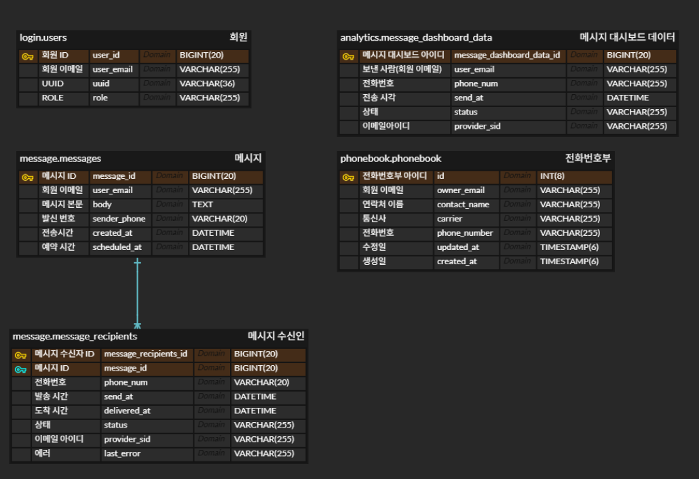
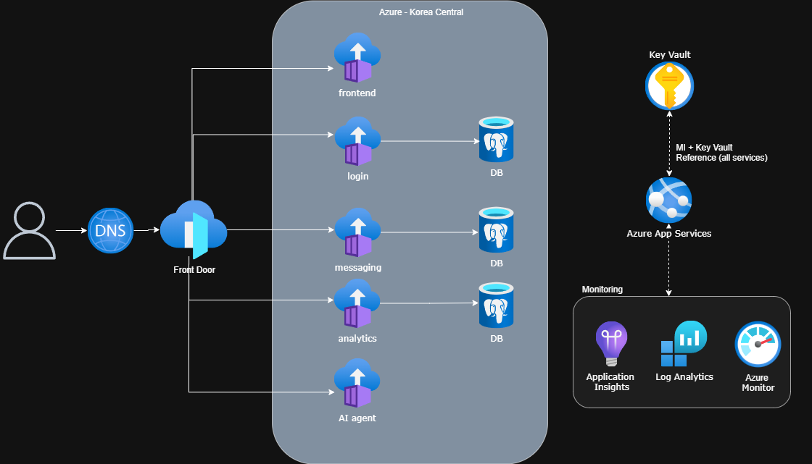

# 📡 공인알림문자 서비스 — MSA Project Hub

> 공공 및 민간 기관의 대량 알림(SMS)을 **신뢰성 있고 효율적**으로 전송하고,  
> **통계 시각화·AI Agent 지원**까지 제공하는 MSA 학습/실전 프로젝트입니다.

---

## 🧭 프로젝트 개요

- **프로덕트 이름**: 공인알림문자 서비스  
- **비전**: 효율적이고 신뢰할 수 있는 정보 전달의 표준 제시  
- **미션**: 기관과 고객 간 소통을 돕고 사회적 비용을 절감하는 솔루션 제공  

### 핵심가치
- **신뢰성**: 법적 효력 있는 증명서 제공으로 정보 신뢰도 보장  
- **편의성**: 별도 앱 설치 없이 간편한 문서 확인/보관  
- **효율성**: 발송 기관의 절차 단순화 및 예산 절감 기여  
- **지속 가능성**: 페이퍼리스화로 친환경적 가치 실현  

---

## 🎯 전략과제

1. **메시지 보내기 (Messaging)**  
   - 메시지 생성, 발송 API (Twilio 등) 연동  
   - 상태 콜백(queued, delivered, failed 등) 처리  

2. **통계 자료 시각화 (Analytics)**  
   - 전송 로그 수집 및 DB 저장  
   - 성공률/실패 사유 분석, 시간대별 그래프  

3. **AI Agent**  
   - 사용자가 입력한 문구 → 교정/추천/FAQ 응답 제공  
   - OpenAI API 연동  

4. **전화번호부 (Phonebook)**  
   - 단체문자 발송 편의를 위해 별도 CRUD 서비스 구성  
   - 독립 DB 운영, Messaging 서비스에서 API 호출  

---

## 🏗️ 시스템 아키텍처

### 기술 스택
- **Back-end**: Spring Boot  
- **Front-end**: React  
- **Infra**: Azure (App Service → ACA → AKS 고도화)  
- **DB**: Azure DB for PostgreSQL (서비스별 DB 분리)  
- **Secret 관리**: `.env`(로컬), Azure App Service 환경변수 & Key Vault  

### 포트 정책
- Frontend: `3000`  
- Backend 서비스들: `8080`  

### ERD

### Architecture

---

## 📦 서비스 레포지토리

| 서비스 | 설명 | DB |
|---|---|---|
| [`api-messaging-svc`](https://github.com/KTCrack01/api-messaging-svc) | 메시지 생성/전송, 수신자 기록, 상태 콜백 처리 | messaging-db |
| [`api-analytics-svc`](https://github.com/KTCrack01/api-analytics-svc) | 전송 로그 집계, 대시보드 API | analytics-db |
| [`api-phonebook-svc`](https://github.com/KTCrack01/api-phonebook-svc) | 전화번호부 CRUD, 단체 발송 대상 제공 | phonebook-db |
| [`api-login-svc`](https://github.com/KTCrack01/api-login-svc) | 사용자 로그인 관리 (OAuth2/JWT는 추후 고도화) | login-db |
| [`api-aiagent-svc`](https://github.com/KTCrack01/api-aiagent-svc) | OpenAI API 백엔드 프록시 (Key Vault 관리) | - |
| [`web-frontend`](https://github.com/KTCrack01/web-frontend) | React 기반 UI (Dashboard, Messaging, Phonebook, AI) | - |

> 전체 목록: [KTCrack01 · Repositories](https://github.com/orgs/KTCrack01/repositories)

---

## 📚 Architecture Decision Records (ADR)

허브 내 `docs/adr/` 경로에 기록  

| 번호 | 제목 | 상태 | 링크 |
|------|------|------|------|
| ADR-001 | Database Per Service | Accepted | [ADR-001](docs/adr/ADR-001-database-per-service.md) |
| ADR-002 | Authentication Strategy | Deferred | [ADR-002](docs/adr/ADR-002-authentication-strategy.md) |
| ADR-003 | Azure Deployment Strategy | Accepted | [ADR-003](docs/adr/ADR-003-azure-deployment-strategy.md) |
| ADR-004 | Service Port Convention | Accepted | [ADR-004](docs/adr/ADR-004-service-port-convention.md) |
| ADR-005 | Dummy Data Usage | Accepted | [ADR-005](docs/adr/ADR-005-dummy-data-usage.md) |
| ADR-006 | OpenAI API Integration | Accepted | [ADR-006](docs/adr/ADR-006-openai-api-integration.md) |
| ADR-007 | Messaging AI History Component | Accepted | [ADR-007](docs/adr/ADR-007-messaging-ai-history.md) |
| ADR-008 | Phonebook Service Separation | Accepted | [ADR-008](docs/adr/ADR-008-phonebook-service-separation.md) |
| ADR-009 | Secret and Config Management | Accepted | [ADR-009](docs/adr/ADR-009-secret-and-config-management.md) |
| ADR-0010 | Secret and Config Management | Accepted | [ADR-010](docs/adr/ADR-010-ci-cd-tool.md) |
| ADR-0011 | Secret and Config Management | Accepted | [ADR-011](docs/adr/ADR-011-branch-strategy.md) |
| ADR-0012 | Secret and Config Management | Accepted | [ADR-012](docs/adr/ADR-012-image-tagging.md) |

---

## 🚀 개발/운영 메모

- **로컬**: `.env` 파일 관리 (`.gitignore`, `.dockerignore` 포함)  
- **컨테이너**: 빌드시 `.env` 제외, 실행 시 주입  
- **운영(Azure)**: App Service 환경변수 + Key Vault  
- **배포 전략**: App Service → ACA → AKS 단계적 고도화  

---
