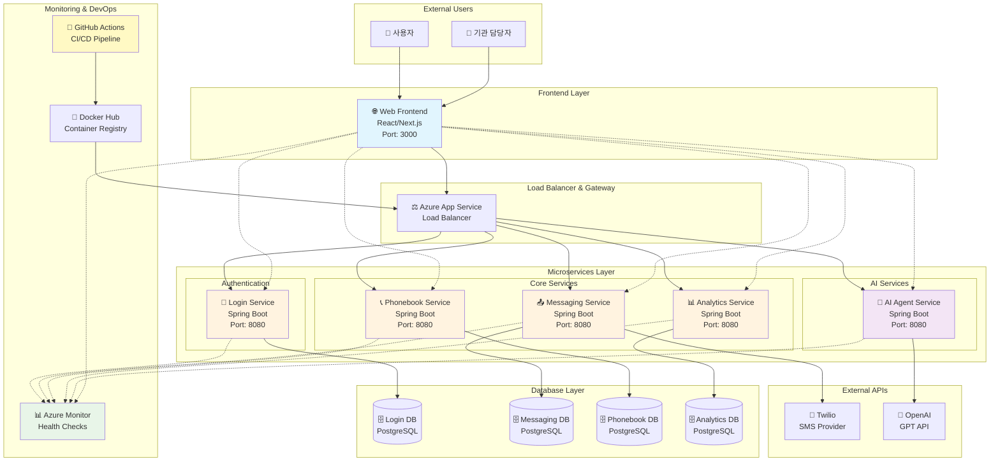

# 🏗️ 공인알림문자 서비스 - 시스템 아키텍처

> **MSA(Microservices Architecture) 기반 분산 시스템 설계**

---

## 📐 **전체 아키텍처 개요**



---

## 🎯 **아키텍처 설계 원칙**

### **1. Microservices Architecture (MSA)**
- **서비스별 독립성**: 각 서비스가 독립적으로 개발, 배포, 확장 가능
- **Database Per Service**: 서비스별 전용 데이터베이스로 결합도 최소화
- **API 기반 통신**: RESTful API를 통한 서비스간 통신

### **2. Cloud-Native Design**
- **컨테이너화**: Docker 기반 배포로 환경 일관성 보장
- **자동 확장**: Azure App Service의 auto-scaling 활용
- **고가용성**: 여러 인스턴스를 통한 장애 대응

### **3. DevOps 통합**
- **CI/CD 자동화**: GitHub Actions를 통한 완전 자동 배포
- **모니터링**: Azure Monitor + Spring Boot Actuator 헬스체크
- **보안**: OIDC 기반 인증, 환경변수 분리

---

## 📦 **계층별 상세 설명**

### **🌐 Presentation Layer (프레젠테이션 계층)**

#### **Web Frontend**
- **기술 스택**: React 18, Next.js 15, TypeScript
- **UI Framework**: Tailwind CSS, Shadcn/ui
- **상태 관리**: React Hooks, Context API
- **주요 기능**:
  - 🏠 통합 대시보드
  - 📤 메시지 송신 인터페이스
  - 📞 전화번호부 관리
  - 🤖 AI Agent 채팅
  - 📊 통계 시각화

### **⚖️ Gateway Layer (게이트웨이 계층)**

#### **Azure App Service Load Balancer**
- **역할**: 트래픽 분산 및 라우팅
- **기능**:
  - SSL/TLS 인증서 자동 관리
  - 헬스체크 기반 트래픽 라우팅
  - 자동 스케일링 지원

### **⚙️ Application Layer (애플리케이션 계층)**

#### **🔐 Authentication Service (api-login-svc)**
- **책임**: 사용자 인증 및 권한 관리
- **기능**:
  - 회원가입/로그인
  - 패스워드 암호화 (BCrypt)
  - 사용자 정보 관리
- **Database**: login-db (PostgreSQL)

#### **📤 Messaging Service (api-messaging-svc)**
- **책임**: 메시지 전송 및 상태 관리
- **기능**:
  - SMS 메시지 전송 (Twilio 연동)
  - 전송 상태 추적
  - 대량 발송 처리
  - 콜백 처리 (delivered, failed 등)
- **Database**: messaging-db (PostgreSQL)
- **External API**: Twilio SMS

#### **📞 Phonebook Service (api-phonebook-svc)**
- **책임**: 연락처 정보 관리
- **기능**:
  - 연락처 CRUD
  - 그룹별 관리
  - 검색 및 필터링 (이름, 전화번호, 통신사)
  - 권한 기반 접근 제어
- **Database**: phonebook-db (PostgreSQL)

#### **📊 Analytics Service (api-analytics-svc)**
- **책임**: 통계 분석 및 대시보드 데이터 제공
- **기능**:
  - 전송 로그 수집 및 분석
  - 성공률/실패율 계산
  - 시간대별 통계
  - 월별/일별 집계
- **Database**: analytics-db (PostgreSQL)

#### **🤖 AI Agent Service (api-aiagent-svc)**
- **책임**: AI 기반 메시지 지원
- **기능**:
  - OpenAI GPT API 프록시
  - 메시지 교정 및 추천
  - 다양한 GPT 모델 지원 (GPT-4, GPT-3.5-turbo 등)
  - FAQ 응답 생성
- **External API**: OpenAI API

### **🗄️ Data Layer (데이터 계층)**

#### **Database Per Service 패턴**
- **login-db**: 사용자 정보, 인증 데이터
- **messaging-db**: 메시지 내역, 수신자 정보, 전송 상태
- **phonebook-db**: 연락처 정보, 그룹 데이터
- **analytics-db**: 전송 통계, 집계 데이터

#### **Database 기술 스택**
- **DBMS**: PostgreSQL 14+
- **ORM**: Spring Data JPA + Hibernate
- **Connection Pool**: HikariCP
- **Migration**: JPA DDL Auto (개발), Manual SQL (운영)

### **📊 Monitoring Layer (모니터링 계층)**

#### **Azure Monitor**
- **메트릭 수집**: CPU, 메모리, 네트워크 사용량
- **로그 수집**: 애플리케이션 로그, HTTP 요청 로그
- **알림**: 임계치 기반 알림 (추후 구현)

#### **Spring Boot Actuator**
- **헬스체크**: `/actuator/health` 엔드포인트
- **메트릭**: JVM, 데이터베이스 연결 상태
- **정보**: 애플리케이션 정보, 빌드 정보

### **🚀 DevOps Layer (데브옵스 계층)**

#### **CI/CD Pipeline (GitHub Actions)**
```yaml
트리거: main 브랜치 푸시
1. 소스코드 체크아웃
2. 빌드 (Gradle/NPM)
3. Docker 이미지 생성
4. 이미지 태깅 (MMDD_HHMM)
5. Docker Hub 푸시
6. Azure OIDC 인증
7. App Service 배포
8. 헬스체크 확인
```

#### **컨테이너 전략**
- **Base Image**: eclipse-temurin:21-jre (Backend), node:alpine (Frontend)
- **Multi-stage Build**: 빌드와 런타임 이미지 분리
- **Security**: Non-root 사용자 실행
- **Optimization**: 레이어 캐싱, 의존성 캐싱

---

## 🔄 **데이터 플로우**

### **1. 메시지 전송 플로우**
```
사용자 → Frontend → Messaging Service → Twilio API → SMS 전송
                        ↓
               Analytics Service ← 전송 결과 로깅
```

### **2. AI 지원 플로우**
```
사용자 → Frontend → AI Agent Service → OpenAI API → GPT 응답
                        ↓
                   Frontend ← 개선된 메시지 제안
```

### **3. 통계 분석 플로우**
```
Messaging Service → Analytics DB → Analytics Service → Frontend Dashboard
```

---

## 🛡️ **보안 아키텍처**

### **인증 및 권한**
- **Frontend**: 세션 기반 인증
- **Backend**: 서비스간 API 키 인증
- **External API**: Bearer Token (OpenAI), API Key (Twilio)

### **네트워크 보안**
- **HTTPS**: 모든 통신 암호화
- **CORS**: 도메인 기반 접근 제어
- **환경변수**: 민감 정보 분리 관리

### **데이터 보안**
- **암호화**: 패스워드 BCrypt 해싱
- **접근 제어**: 이메일 기반 소유권 검증
- **데이터 격리**: 서비스별 독립 데이터베이스

---

## 📈 **확장성 고려사항**

### **수평 확장 (Scale Out)**
- **Stateless Design**: 모든 서비스가 상태를 외부 저장소에 보관
- **Auto Scaling**: Azure App Service의 자동 확장 기능
- **Load Balancing**: 여러 인스턴스 간 트래픽 분산

### **수직 확장 (Scale Up)**
- **리소스 모니터링**: CPU, 메모리 사용량 추적
- **성능 튜닝**: JVM 옵션, 커넥션 풀 최적화
- **캐싱 전략**: 데이터베이스 부하 분산

### **지역 확장 (Multi-Region)**
- **Database Replication**: 읽기 전용 복제본 활용 가능
- **CDN 활용**: 정적 자원 전역 분산
- **Latency Optimization**: 지역별 서비스 배치

---

## 🎯 **아키텍처 장점**

### **🔄 유연성**
- **독립 배포**: 서비스별 독립적인 릴리즈 사이클
- **기술 다양성**: 서비스별 최적 기술 스택 선택 가능
- **팀 자율성**: 서비스별 팀 독립 개발

### **🛡️ 안정성**
- **장애 격리**: 한 서비스 장애가 전체 시스템에 미치는 영향 최소화
- **중복성**: 중요 서비스의 다중 인스턴스 운영
- **복구 능력**: 서비스별 독립적인 장애 복구

### **📊 관찰성**
- **분산 모니터링**: 서비스별 상세 메트릭 수집
- **헬스체크**: 실시간 서비스 상태 확인
- **로그 추적**: 요청 흐름 추적 가능

### **💰 비용 효율성**
- **리소스 최적화**: 서비스별 필요한 만큼의 리소스 할당
- **자동 스케일링**: 트래픽에 따른 자동 리소스 조절
- **클라우드 네이티브**: 클라우드 서비스 최대 활용

---

## 📋 **기술 결정 근거**

각 기술 선택의 상세한 근거는 [Architecture Decision Records (ADR)](../README.md#-architecture-decision-records-adr)를 참조하세요.

- **[ADR-001](adr/ADR-001-database-per-service.md)**: Database Per Service 패턴 선택
- **[ADR-003](adr/ADR-003-azure-deployment-strategy.md)**: Azure 배포 전략
- **[ADR-010](adr/ADR-010-ci-cd-tool.md)**: GitHub Actions CI/CD 도구 선택
- **[ADR-013](adr/ADR-013-health-check-strategy.md)**: 헬스체크 전략
- **[ADR-014](adr/ADR-014-monitoring-strategy.md)**: 모니터링 전략
- **[ADR-015](adr/ADR-015-oidc-authentication-strategy.md)**: OIDC 인증 전략

---

> **📋 Last Updated**: 2025-08-21  
> **🎯 Architecture Status**: Production Ready ✨
