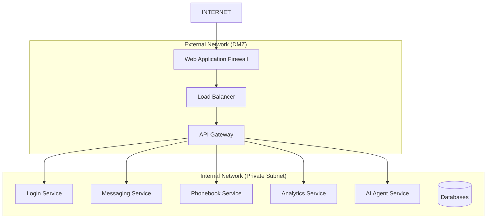

# 🔒 보안 분석 및 고도화 방안

> **현재 상태**: MVP 완성, 보안 강화 필요  
> **목표**: Enterprise급 보안 아키텍처 구현  
> **우선순위**: 높음 (Production 배포 전 필수)

---

## 🚨 **현재 보안 취약점 분석**

### **🔓 Critical 보안 이슈**

#### **1. API 엔드포인트 완전 노출**
```
❌ 현재 상태: 모든 API가 공개적으로 접근 가능
📍 취약점: https://analytics-svc-xxx.azurewebsites.net/api/dashboard/create
          https://messaging-svc-xxx.azurewebsites.net/api/messages/send
          https://phonebook-svc-xxx.azurewebsites.net/api/phonebook
          
⚠️  위험도: HIGH
💥 영향: 무단 API 호출, 데이터 유출, 서비스 남용
```

#### **2. 시크릿 관리 취약점**
```
❌ 현재 상태: GitHub Secrets → 환경변수 직접 주입
📍 취약점: 
   - OPENAI_API_KEY, TWILIO_API_KEY 등이 App Service 환경변수에 평문 저장
   - 로그에 시크릿 노출 가능성
   - 시크릿 로테이션 불가
   
⚠️  위험도: HIGH  
💥 영향: API 키 탈취 시 외부 서비스 비용 청구, 데이터 유출
```

#### **3. 네트워크 보안 미흡**
```
❌ 현재 상태: 모든 서비스가 인터넷에 직접 노출
📍 취약점:
   - 내부 서비스간 통신도 인터넷을 거침  
   - DDoS 공격에 취약
   - 네트워크 레벨 접근 제어 없음
   
⚠️  위험도: MEDIUM
💥 영향: 서비스 가용성 저하, 내부 통신 탈취 가능
```

#### **4. 인증/인가 체계 부재**
```
❌ 현재 상태: 서비스간 인증 없이 API 호출
📍 취약점:
   - Frontend → Backend API 호출 시 인증 없음
   - 서비스간 내부 API도 무인증 호출
   - 사용자 권한 체계 미구현
   
⚠️  위험도: HIGH
💥 영향: 권한 없는 사용자의 시스템 접근 및 조작
```

### **🔶 Medium 보안 이슈**

#### **5. CORS 정책 과도하게 열림**
```java
// 현재 설정 (모든 서비스 공통)
@CrossOrigin(origins = "*")  // ❌ 모든 도메인 허용
```

#### **6. 에러 정보 노출**
```
❌ Spring Boot 기본 에러 페이지에서 내부 정보 노출 가능
❌ API 응답에 스택 트레이스 포함 가능성
```

#### **7. 로깅 보안 미흡**
```
❌ 민감 정보(API 키, 개인정보)가 로그에 포함될 가능성
❌ 로그 접근 권한 관리 부재
```

---

## 🛡️ **보안 강화 로드맵**

### **🎯 Phase 1: 즉시 적용 가능한 보안 강화 (1-2주)**

#### **1.1 Azure Key Vault 도입**
```yaml
# azure-key-vault-integration.yml
구현 내용:
- ✅ Azure Key Vault 리소스 생성
- ✅ API 키 (OpenAI, Twilio) Key Vault로 이전
- ✅ App Service → Key Vault 연동 설정
- ✅ 환경변수에서 시크릿 제거

기대 효과:
- 🔒 시크릿 중앙 관리 및 암호화 저장
- 🔄 시크릿 로테이션 자동화 가능
- 📊 시크릿 접근 로그 및 감사
```

#### **1.2 API 인증 체계 구현**
```java
// JWT 기반 API 인증 구현
@Configuration
public class SecurityConfig {
    // API Gateway 또는 각 서비스에 JWT 검증 로직 추가
    // Bearer Token 기반 API 호출로 변경
}

적용 범위:
- ✅ Frontend → Backend API 호출
- ✅ 서비스간 내부 API 호출 (Service-to-Service JWT)
- ✅ 사용자 권한 기반 접근 제어
```

#### **1.3 CORS 정책 강화**
```java
// 보안 강화된 CORS 설정
@CrossOrigin(
    origins = {
        "https://web-frontend-xxx.azurewebsites.net",
        "https://your-custom-domain.com"
    },
    allowedMethods = {"GET", "POST", "PUT", "DELETE"},
    allowCredentials = true
)
```

### **🏗️ Phase 2: 아키텍처 레벨 보안 강화 (2-4주)**

#### **2.1 네트워크 분리 및 내부망 구성**


**구현 계획**:
```yaml
1. Azure Virtual Network 구성:
   - Public Subnet: API Gateway, Load Balancer
   - Private Subnet: 모든 마이크로서비스
   - Database Subnet: PostgreSQL (Private)

2. Network Security Groups:
   - 서비스별 포트 제한 (8080만 허용)
   - 내부 서비스간 통신만 허용
   - 외부 인터넷 접근 차단

3. Application Gateway:
   - SSL Termination
   - WAF 기능 활성화
   - Rate Limiting
   - DDoS Protection
```

#### **2.2 Kubernetes 기반 컨테이너 오케스트레이션**
```yaml
# kubernetes-architecture.yml
Original Plan (당초 계획):

1. AKS (Azure Kubernetes Service) 클러스터 구성
2. Kubernetes Ingress Controller 
3. Service Mesh (Istio) 도입
4. Pod-to-Pod 통신 암호화
5. RBAC (Role-Based Access Control)

Benefits:
- 🔒 네트워크 정책 기반 마이크로서비스 격리
- 🚀 자동 스케일링 및 로드 밸런싱  
- 📊 Service Mesh를 통한 트래픽 모니터링
- 🛡️ Pod 레벨 보안 정책 적용
```

#### **2.3 API Gateway 중앙 집중화**
```java
// Spring Cloud Gateway 구현 계획
@Configuration
public class GatewayConfig {
    
    @Bean
    public RouteLocator customRouteLocator(RouteLocatorBuilder builder) {
        return builder.routes()
            .route("login-service", r -> r.path("/api/auth/**")
                .filters(f -> f
                    .rewritePath("/api/auth/(?<segment>.*)", "/api/users/${segment}")
                    .addRequestHeader("X-Internal-Request", "true")
                    .circuitBreaker(config -> config.setName("login-cb"))
                )
                .uri("http://login-service:8080"))
            // 다른 서비스들도 동일하게 라우팅
            .build();
    }
}

보안 기능:
- 🔐 JWT 토큰 검증 (한 곳에서 통합 관리)
- 🚨 Rate Limiting (API 남용 방지)  
- 🔄 Circuit Breaker (장애 전파 차단)
- 📊 API 사용량 모니터링 및 로깅
```

### **🎪 Phase 3: 고급 보안 및 모니터링 (4-8주)**

#### **3.1 통합 모니터링 스택 구축**
```yaml
# monitoring-stack.yml
Original Vision (당초 비전):

1. Observability Stack:
   - Prometheus: 메트릭 수집
   - Grafana: 대시보드 시각화  
   - Jaeger: 분산 트레이싱
   - ELK Stack: 로그 중앙 집중

2. Azure 네이티브 솔루션:
   - Application Insights: APM
   - Log Analytics: 로그 분석
   - Azure Monitor: 알림 및 대시보드

3. 보안 모니터링:
   - Azure Sentinel: SIEM
   - Security Center: 취약점 스캔
   - Key Vault 액세스 로그 모니터링
```

#### **3.2 부하 테스트 및 성능 최적화**
```yaml
# load-testing-plan.yml  
Original Plan (당초 계획):

1. Load Testing Tools:
   - Apache JMeter: API 부하 테스트
   - Artillery: 실시간 부하 생성
   - Azure Load Testing: 클라우드 기반 테스트

2. 테스트 시나리오:
   - 동시 사용자 1,000명 SMS 발송
   - AI Agent 동시 요청 처리 능력
   - Database Connection Pool 한계 테스트
   - API Gateway Rate Limiting 검증

3. 성능 최적화:
   - Database 쿼리 최적화
   - Redis 캐싱 레이어 추가
   - CDN을 통한 정적 자산 최적화
   - JVM 튜닝 및 GC 최적화
```

#### **3.3 보안 테스트 및 취약점 스캔**
```yaml
# security-testing.yml
구현 예정:

1. 자동화된 보안 스캔:
   - SonarQube: 코드 정적 분석
   - OWASP ZAP: 웹 애플리케이션 취약점 스캔
   - Docker 이미지 보안 스캔

2. 침투 테스트:
   - API 인증 우회 시도
   - SQL Injection 테스트  
   - XSS 공격 시뮬레이션
   - 권한 상승 공격 테스트

3. 규정 준수:
   - GDPR 데이터 보호 규정
   - ISO 27001 보안 표준
   - OWASP Top 10 취약점 검증
```

---

## 🎯 **Enterprise급 목표 아키텍처**

### **🏛️ 최종 보안 아키텍처 비전**
```mermaid
graph TB
    subgraph "External Users"
        USERS[👥 Users]
    end
    
    subgraph "DMZ (Public Network)"
        CDN[🌐 Azure CDN]
        WAF[🛡️ Web Application Firewall] 
        APIGW[🚪 API Gateway<br/>+ JWT Validation]
        LB[⚖️ Load Balancer]
    end
    
    subgraph "Private Network"
        subgraph "Web Tier"
            WEB[🖥️ Frontend<br/>(React)]
        end
        
        subgraph "App Tier (AKS Cluster)"
            LOGIN[🔐 Login Service]
            MSG[📤 Messaging Service] 
            PHONE[📞 Phonebook Service]
            ANALYTICS[📊 Analytics Service]
            AI[🤖 AI Agent Service]
        end
        
        subgraph "Data Tier"
            DB1[(🗄️ Login DB)]
            DB2[(🗄️ Messaging DB)]
            DB3[(🗄️ Phonebook DB)] 
            DB4[(🗄️ Analytics DB)]
            CACHE[(⚡ Redis Cache)]
        end
    end
    
    subgraph "Security & Monitoring"
        KV[🔑 Key Vault]
        MON[📊 Monitoring Stack<br/>Prometheus + Grafana]
        LOG[📝 Log Analytics]
        SIEM[🔍 Azure Sentinel]
    end
    
    subgraph "External APIs"
        TWILIO[📱 Twilio API]
        OPENAI[🧠 OpenAI API]
    end
    
    USERS --> CDN
    CDN --> WAF
    WAF --> LB
    LB --> APIGW
    APIGW --> WEB
    WEB -.-> APIGW
    APIGW --> LOGIN
    APIGW --> MSG
    APIGW --> PHONE
    APIGW --> ANALYTICS
    APIGW --> AI
    
    LOGIN --> DB1
    MSG --> DB2
    PHONE --> DB3
    ANALYTICS --> DB4
    
    MSG --> CACHE
    ANALYTICS --> CACHE
    
    MSG --> TWILIO
    AI --> OPENAI
    
    LOGIN -.-> KV
    MSG -.-> KV
    AI -.-> KV
    
    LOGIN -.-> MON
    MSG -.-> MON
    PHONE -.-> MON
    ANALYTICS -.-> MON
    AI -.-> MON
    
    MON --> LOG
    LOG --> SIEM
```

### **🔒 보안 레이어별 상세 설명**

#### **Network Security (L3/L4)**
- **Azure Virtual Network**: 프라이빗 네트워크 구성
- **Network Security Groups**: 포트 및 프로토콜 레벨 제어  
- **Azure Firewall**: 고급 네트워크 방화벽
- **DDoS Protection**: 대용량 공격 방어

#### **Application Security (L7)**  
- **Web Application Firewall**: OWASP Top 10 방어
- **API Gateway**: 중앙 집중 인증/인가
- **Rate Limiting**: API 남용 방지
- **JWT 토큰**: 상태 없는 인증

#### **Data Security**
- **Azure Key Vault**: 시크릿 중앙 관리
- **데이터베이스 암호화**: TDE (Transparent Data Encryption)
- **백업 암호화**: 저장 데이터 보호
- **RBAC**: 세분화된 권한 관리

#### **Monitoring & Response**
- **SIEM**: 보안 이벤트 상관관계 분석
- **실시간 알림**: 이상 행위 즉시 탐지
- **로그 중앙 집중**: 모든 보안 이벤트 추적
- **자동 대응**: 위협 발견 시 자동 차단

---

## 💡 **구현 우선순위 및 ROI**

### **🔥 High Priority (즉시 구현)**
1. **Azure Key Vault 도입** - ROI: ⭐⭐⭐⭐⭐
   - 구현 난이도: 낮음
   - 보안 효과: 높음
   - 예상 소요: 1-2일

2. **API 인증 체계** - ROI: ⭐⭐⭐⭐⭐  
   - 구현 난이도: 중간
   - 보안 효과: 매우 높음
   - 예상 소요: 3-5일

3. **CORS 정책 강화** - ROI: ⭐⭐⭐⭐☆
   - 구현 난이도: 낮음  
   - 보안 효과: 중간
   - 예상 소요: 1일

### **🎯 Medium Priority (단계별 구현)**
4. **API Gateway 도입** - ROI: ⭐⭐⭐⭐☆
   - 구현 난이도: 높음
   - 보안 효과: 높음  
   - 예상 소요: 1-2주

5. **네트워크 분리** - ROI: ⭐⭐⭐☆☆
   - 구현 난이도: 매우 높음
   - 보안 효과: 중간
   - 예상 소요: 2-4주

### **🔮 Long-term (미래 계획)**
6. **Kubernetes 이전** - ROI: ⭐⭐⭐☆☆
   - 구현 난이도: 매우 높음
   - 보안 효과: 높음
   - 예상 소요: 4-8주

7. **완전한 모니터링 스택** - ROI: ⭐⭐⭐☆☆
   - 구현 난이도: 높음
   - 운영 효과: 높음
   - 예상 소요: 4-6주

---

## 🎓 **보안 학습 및 성장 관점**

### **📚 이번 프로젝트를 통한 보안 학습**
1. **현실적 제약 조건에서의 보안 구현**
2. **MVP vs 완전한 보안** 사이의 트레이드오프 이해
3. **클라우드 네이티브 보안 모델** 경험
4. **보안 부채(Security Debt)** 관리 방법론

### **🚀 향후 보안 전문성 발전 방향**
1. **클라우드 보안 자격증** (Azure Security, AWS Security)
2. **컨테이너 보안** (Docker, Kubernetes Security)
3. **DevSecOps** 문화 및 자동화 도구
4. **보안 아키텍처 설계** 전문성

---

> **📝 결론**: 현재 MVP는 기능적으로 완성되었으나, **Enterprise급 Production 배포**를 위해서는 체계적인 보안 강화가 필수입니다. 단계적 접근을 통해 **보안 성숙도**를 점진적으로 높여갈 계획입니다.

**이 문서는 "완벽하지 않음을 인정하되, 명확한 개선 계획을 가지고 있음"을 보여주는 중요한 자료입니다.** ✨
